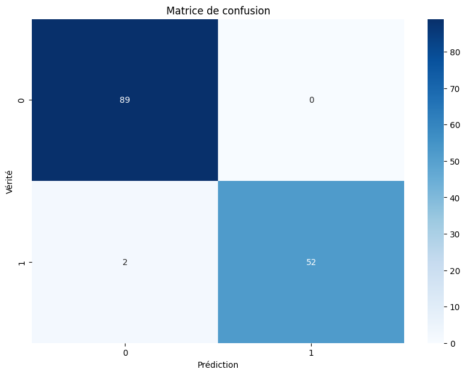

# Détection Cancer du seins

Ce notebook présente une analyse complète d'un dataset de cancer du sein provenant de Kaggle. Voici les étapes principales réalisées :

1. **Importation des librairies** : Chargement de pandas, seaborn, matplotlib, scikit-learn, etc.
2. **Téléchargement et extraction du dataset** via l'API Kaggle.
3. **Chargement et exploration des données** :
    - Lecture du fichier CSV dans un DataFrame `df`.
    - Affichage des premières lignes, suppression des colonnes avec valeurs nulles, vérification des doublons, et analyse de la répartition de la variable cible (`diagnosis`).
4. **Prétraitement** :
    - Encodage de la variable cible (`diagnosis`) avec `LabelEncoder`.
    - Séparation des variables explicatives (`X`) et de la cible (`Y`).
    - Découpage du jeu de données en ensembles d'entraînement et de test.
    - Mise à l'échelle des caractéristiques avec `StandardScaler`.
5. **Modélisation** :
    - Entraînement d'un modèle de régression logistique.
    - Prédiction sur l'ensemble de test.
6. **Évaluation** :
    
    - Affichage de la matrice de confusion et du rapport de classification.
    - Visualisation de la matrice de confusion avec seaborn.
    - Calcul de l'accuracy du modèle (≈ 98,6%).